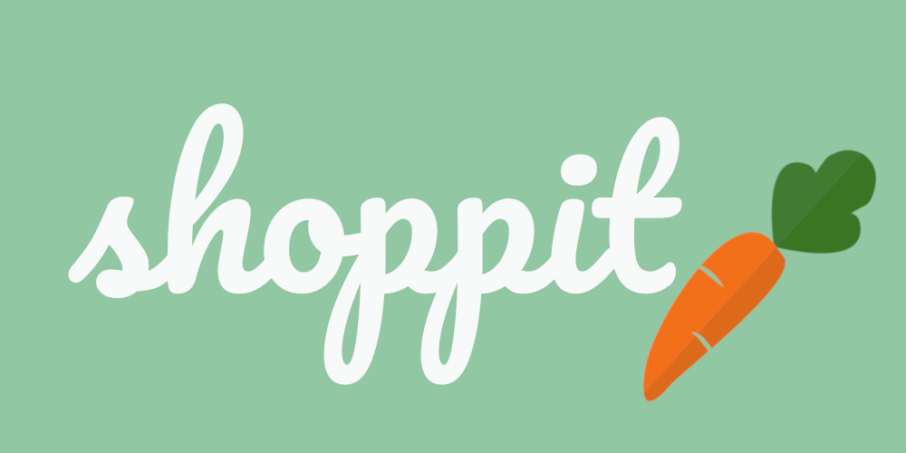
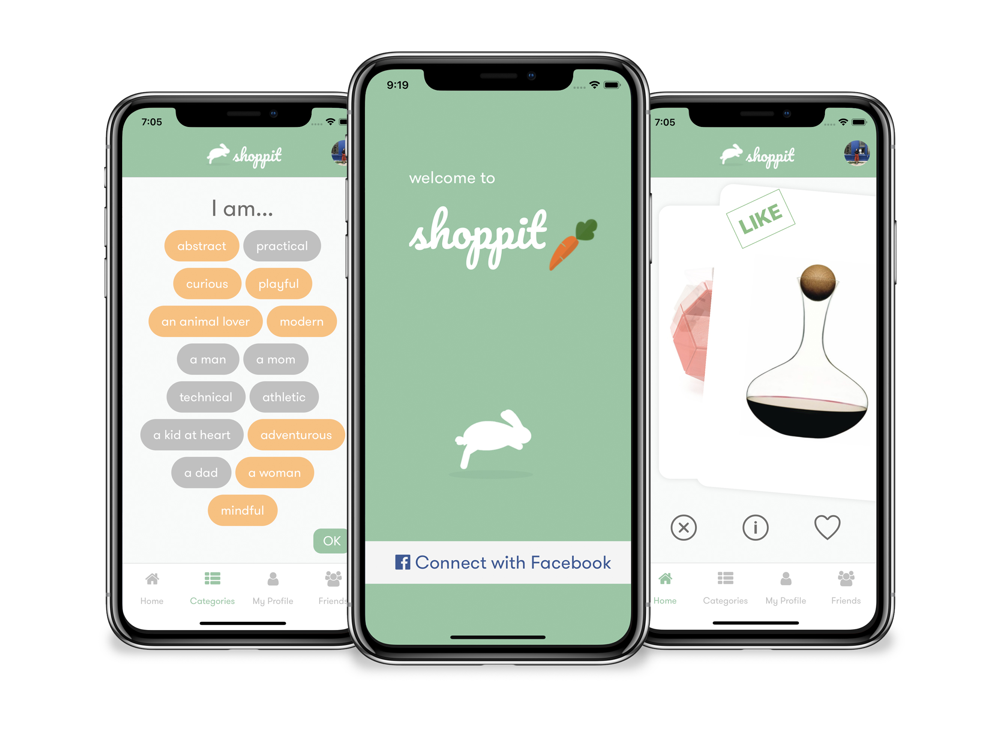
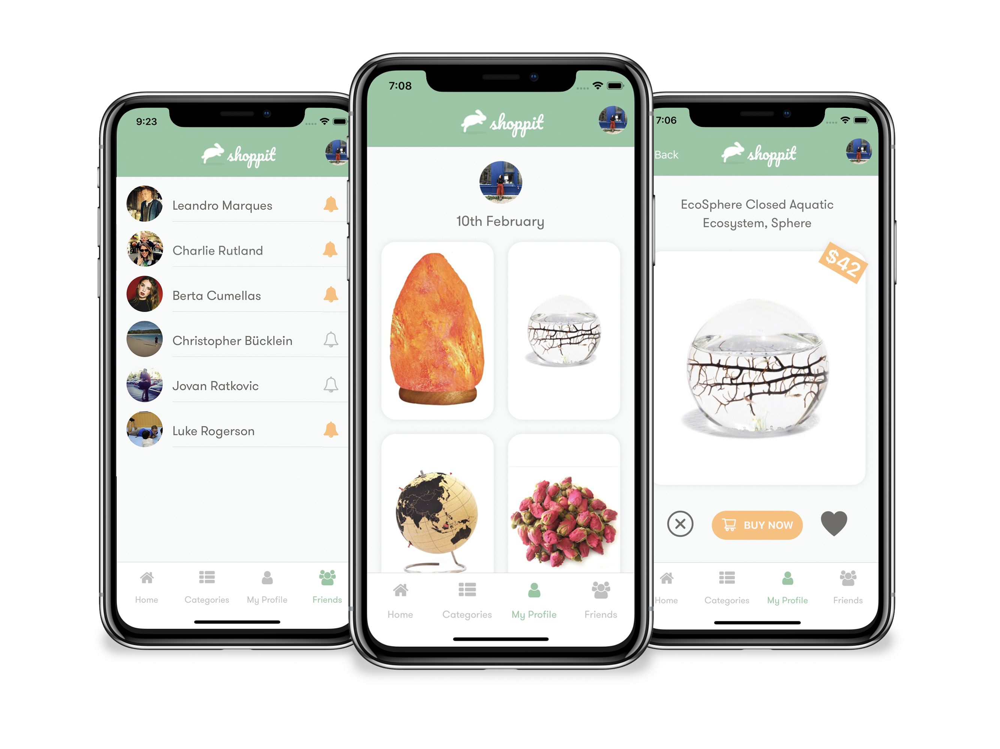

# Shoppit - Client

> Frontend client files for the Shoppit mobile app.

<p align="center">
 
</p> 

**Shoppit is a social shopping app!**

Spend a few minutes browsing our personalised, curated products. Buy something nice for yourself or a friend! Never forget a birthday again!

## Table of contents

- [Screenshots](#screenshots)
- [Getting started](#getting-started)
- [Motivation](#motivation)
- [Usage](#usage)
- [Tech Stack](#tech-stack)
- [Developers team](#developers-team)
- [License](#license)

## Screenshots

<p align="center">
 
</p>

After connecting the app with Facebook, Shoppit will automatically detect a few categories you'll like and save them to your profile. If your recommendations feel a bit stale, you can customize your them at any time by saving whatever categories interest you. Tap on the home screen again to see your dynamically-updated item feed. Find something you like? Swipe right to save it on your profile!

<p align="center">
 
</p>

Connect to your friends without the hassle! Your friends list is automatically generated from your Facebook connections. Make sure you never forget a birthday again by tapping the bell icon next to a friend's name to subscribe to notifications. Need to get a friend something special? Simply browse their recently liked items on their profile. Just check out an item on their profile to find out more info, and once you find a match, buy it from Amazon directly within the app!

## Motivation 

We wanted to make an app that would make shopping on your phone social and fun! 

We have all forgotten a friend or family member's birthday in the past, so we wanted an easy way we could check and get notified of upcoming birthdays AND then buy them something they actually wanted!

## Getting started

A few things you have to take in consideration before using Shoppit - Client.
After cloning the repo you'll have to :

### Install global and local dependancies:

- [Node](https://nodejs.org/en/): `brew install node`
- [Expo](http://expo.io): ```npm install -g expo-cli```
- [Npm](https://www.npmjs.com/): `npm install`
- If you want to run using the iOS simulator, you'll need to download [Xcode](https://developer.apple.com/xcode/) . It can be found on the Mac App Store.

Before being able to go on, download the [Shoppit server files](https://github.com/rusomarques/shoppit_server/) and follow the steps there to get going!

## Usage

Start the development server:

```bash
cd wisher_frontend
npm start
```

## Tech Stack

### Front-end:

- React Native

- Redux

- Expo

### Back-end: [Shoppit backend](https://github.com/rusomarques/shoppit_server/)

## Developers team

- Luke Rogerson [GitHub](https://github.com/Luke-Rogerson) [LinkedIn](https://www.linkedin.com/in/lukerogerson/)
- Charlie Rutland - [GitHub](https://github.com/charlierutland) [LinkedIn](https://www.linkedin.com/in/charlie-rutland/)
- Amy Kirasack - [GitHub](https://github.com/momentmuse) [LinkedIn](https://www.linkedin.com/in/amy-kirasak/)
- Leandro Marques - [GitHub](https://github.com/rusomarques) [LinkedIn](https://www.linkedin.com/in/leandro-marques-pereira/)

## License

This project is licensed under the MIT License - see the [LICENSE.md](https://github.com/cherlin/trash-walk-backend/blob/develop/LICENSE) file for details
